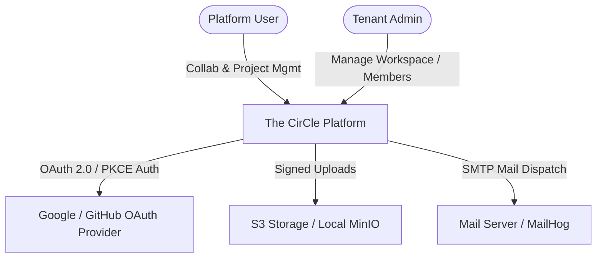
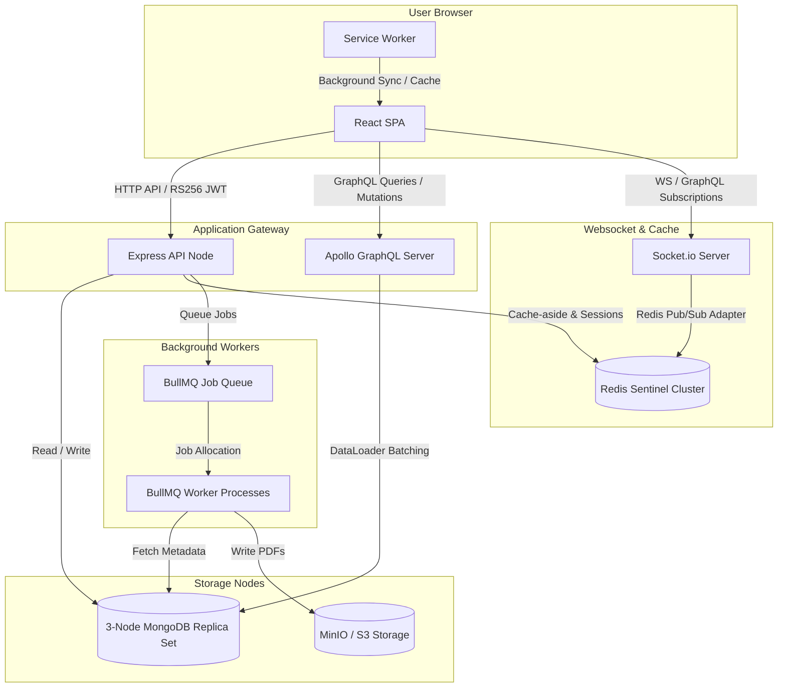
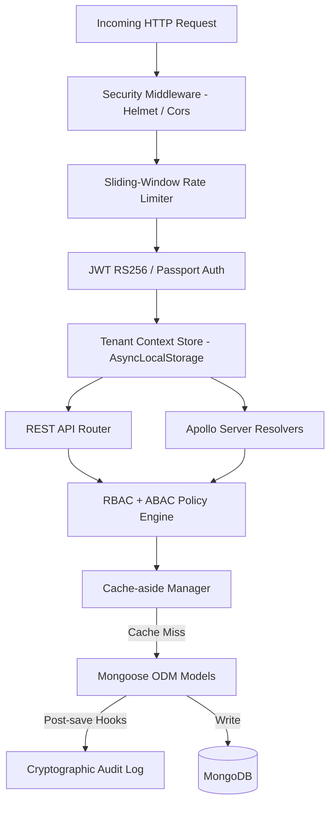

# C4 Architecture Specification: The CirCle Enterprise Collab Hub

This document defines the architectural blueprints of The CirCle, utilizing the C4 model to decompose the system into distinct levels of abstraction (System Context, Containers, and Components).

---

## 1. Level 1: System Context (C1)

The C1 diagram shows the relationship between external actors (Users and Tenants), the The CirCle platform, and external systems (OAuth Identity Providers and S3-compatible cloud storage).

### Context Descriptions
* **Platform User:** Project members, editors, and guests who interact with task boards, collaborative text editors, and Gantt charts.
* **Tenant Admin:** Organisation or Workspace owners who control user memberships and configure custom webhooks.
* **The CirCle Platform:** The central web application that provides real-time collaborative services, task tracking, and document synchronization.
* **OAuth Providers (Google/GitHub):** Handles federated single sign-on flows securely using Authorization Code Flow with PKCE.
* **S3 Storage / Local MinIO:** Stores project attachments, avatars, and compiled PDF reports.
* **SMTP Mail Server:** Transmits system notifications and automated reports.

---

## 2. Level 2: Container Decomposition (C2)

The Container diagram illustrates the logical boundaries of The CirCle, showing how the frontend application, the API gateway, the websocket adapter cluster, background queues, and data layers interoperate.

### Container Responsibilities
* **React SPA (Vite / React 18):** Rendered client-side dashboard containing the Kanban board, Gantt charts, settings interfaces, and the collaborative rich-text editor.
* **Service Worker (Workbox):** Intercepts network calls to provide offline task viewing and queues offline mutations for background synchronization when connection returns.
* **Express API Node:** Serves RESTful endpoints, checks permission rules, handles file validation, and manages session flows.
* **Apollo GraphQL Server:** Runs parallel to the REST endpoints, resolving nested tree queries via DataLoaders and serving subscriptions.
* **Socket.io Server:** Powers bidirectional live message exchanges and CRDT collaborative document states.
* **Redis Sentinel Cluster:** Functions as the shared memory rate limiter, session storage, cache-aside layer, and Socket.io horizontal scaling pub/sub bus.
* **3-Node MongoDB Replica Set:** Normalised, multi-tenant persistence layer with field-level encryption. Runs change streams to invalidate Redis cache keys on mutations.
* **BullMQ & Worker:** Manages asynchronous execution queues for mailers, document exports, webhook delivery retry timers, and rollover crons.

---

## 3. Level 3: Component Diagram (C3) - REST & GraphQL Engine

This diagram reveals the internal component architecture of our application gateway (the server process), showing how incoming HTTP, WebSocket, and GraphQL requests are routed, authenticated, and filtered through our multi-tenant security layers.

### Key Components
1. **Security Middleware:** Uses `helmet` to apply Content Security Policies (CSP), HTTP Strict Transport Security (HSTS), and frames protection.
2. **Rate Limiter:** Query Redis with sorted sets containing request timestamps to enforce sliding window limitations.
3. **Tenant Context Store:** Implemented via Node's `AsyncLocalStorage` to tie the current request's tenant context (`organisationId`) to the execution thread, ensuring no query leaks data to other tenants.
4. **RBAC + ABAC Policy Engine:** An authorization matrix evaluating static roles (Owner, Admin, Member, Guest) against dynamic object attributes (e.g. task assignee status, active sprints).
5. **Cache-aside Manager:** Checks Redis first for read operations, returning cached objects on a hit or fetching from MongoDB and writing back on a miss.
6. **Mongoose Models:** Custom schemas configured with discriminators for tasks, encryption plugins for PII data, and bi-directional reference synchronization hooks.
