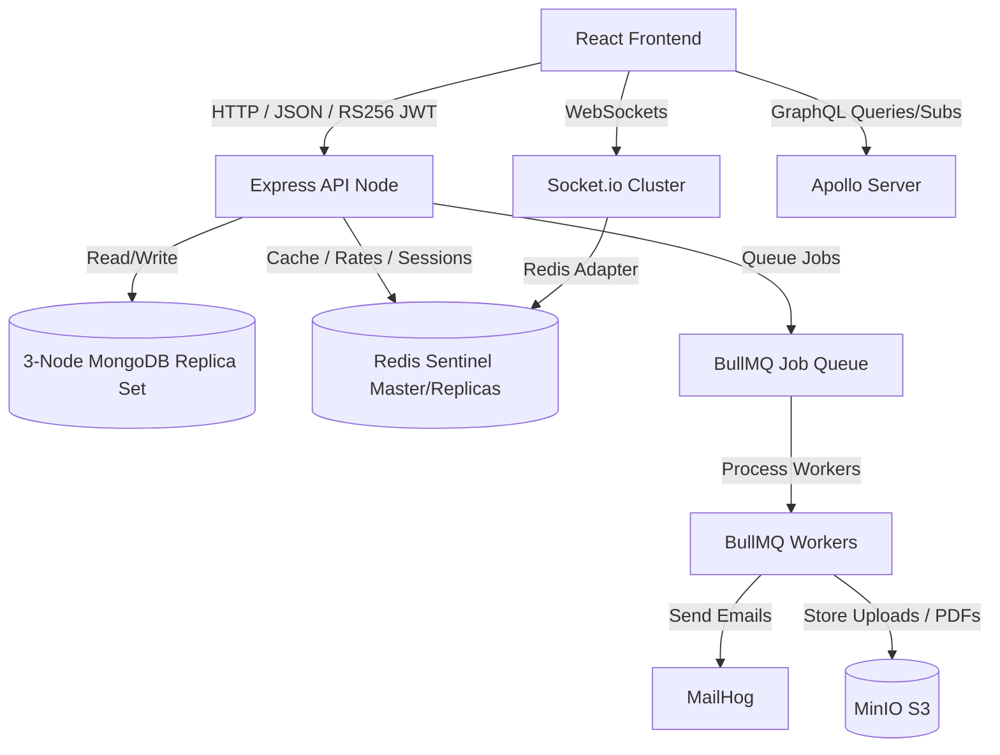

# Master Implementation Plan: Complete Enterprise Overhaul

This master plan details the technical specifications, file layout, and execution steps to satisfy **literally all** client requirements across 3 implementation phases.

---

## Technical Architectural Design

---

## Phase 1: Backend Core, Databases & DevOps Cluster (Block 1)

### 1.1 API Design & Data Modeling
* **6-Level MongoDB Hierarchy:**
  * **File:** `server/models/` ([Organisation](file:///c:/Users/sande/OneDrive/Desktop/JITION/server/models/Organisation.ts), [Workspace](file:///c:/Users/sande/OneDrive/Desktop/JITION/server/models/Workspace.ts), [Project](file:///c:/Users/sande/OneDrive/Desktop/JITION/server/models/Project.ts), [Epic](file:///c:/Users/sande/OneDrive/Desktop/JITION/server/models/Epic.ts), [Story](file:///c:/Users/sande/OneDrive/Desktop/JITION/server/models/Story.ts), [WorkItem](file:///c:/Users/sande/OneDrive/Desktop/JITION/server/models/WorkItem.ts)).
  * **Polymorphic Tasks:** `WorkItem` discriminators (`Bug`, `Feature`, `Chore`, `Spike`).
* **Bi-directional References Middleware:**
  * **File:** [server/models/biDirectional.ts](file:///c:/Users/sande/OneDrive/Desktop/JITION/server/models/biDirectional.ts)
  * **Implementation:** Hook into Mongoose schema post-save and post-remove to atomically `$addToSet` and `$pull` refs on parents (e.g. Workspace updates when Project is created).
* **Strict Tenant Isolation:**
  * **File:** [server/middleware/tenantIsolation.ts](file:///c:/Users/sande/OneDrive/Desktop/JITION/server/middleware/tenantIsolation.ts)
  * **Implementation:** Utilize node's `AsyncLocalStorage` to store `organisationId` per-request and intercept all Mongoose queries to enforce isolation, raising an error if tenant context is missing.
* **Atomic Cascading Soft-Deletes:**
  * **File:** [server/middleware/softDelete.ts](file:///c:/Users/sande/OneDrive/Desktop/JITION/server/middleware/softDelete.ts)
  * **Implementation:** Use `session.withTransaction` to cascade deletions across the entire 6-level hierarchy atomically.

### 1.2 Authentication & Authorization
* **OAuth 2.0 PKCE with Passport.js:**
  * **File:** [server/auth/passport.ts](file:///c:/Users/sande/OneDrive/Desktop/JITION/server/auth/passport.ts)
  * **Implementation:** Integrate Google and GitHub code authorization flow specifying `pkce: true` and state checks.
* **RS256 JWT Access Tokens:**
  * **File:** [server/auth/jwt.ts](file:///c:/Users/sande/OneDrive/Desktop/JITION/server/auth/jwt.ts)
  * **Implementation:** Load asymmetric RSA key pair (private/public) from `.env` to sign 15-minute access tokens.
* **Rotating Refresh Tokens:**
  * **File:** [server/auth/refreshToken.ts](file:///c:/Users/sande/OneDrive/Desktop/JITION/server/auth/refreshToken.ts)
  * **Implementation:** Store in HttpOnly Secure SameSite=Strict cookies, implementing token family invalidation to prevent replay attacks.
* **Custom RBAC + ABAC Permission Engine:**
  * **File:** [server/auth/permissions.ts](file:///c:/Users/sande/OneDrive/Desktop/JITION/server/auth/permissions.ts)
  * **Implementation:** Combine static workspace roles with a rule compiler parsing attributes (`task.assigneeId`, `sprint.active`, `workspace.tier`).

### 1.3 Containerisation & Orchestration
* **Multi-stage Dockerfiles:**
  * **Files:** [Dockerfile.backend](file:///c:/Users/sande/OneDrive/Desktop/JITION/Dockerfile.backend), [Dockerfile.frontend](file:///c:/Users/sande/OneDrive/Desktop/JITION/Dockerfile.frontend)
  * **Implementation:** Distroless/Alpine base configurations executing under non-root users with read-only root filesystems.
* **docker-compose.yml:**
  * **File:** [docker-compose.yml](file:///c:/Users/sande/OneDrive/Desktop/JITION/docker-compose.yml)
  * **Services:** Node backend, React frontend, 3-node MongoDB Replica Set, Redis Sentinel Cluster (1 master + 2 replicas), MinIO (S3 bucket), MailHog (SMTP trap).
* **Kubernetes Manifests:**
  * **Files:** [k8s/](file:///c:/Users/sande/OneDrive/Desktop/JITION/k8s/) folder configurations (Deployment, Services, HPA, PodDisruptionBudget, NetworkPolicy).

---

## Phase 2: Real-time, Queueing, Caching & Testing Suite (Block 2)

### 2.1 Socket.io & Collaborative Document Edits
* **Socket.io Cluster:**
  * **File:** [server/socket/index.ts](file:///c:/Users/sande/OneDrive/Desktop/JITION/server/socket/index.ts)
  * **Implementation:** Setup horizontal scaling using `@socket.io/redis-adapter` for Redis Sentinel pub/sub events.
* **Collaborative OT/CRDT:**
  * **File:** [server/socket/crdt.ts](file:///c:/Users/sande/OneDrive/Desktop/JITION/server/socket/crdt.ts)
  * **Implementation:** Implement Yjs socket protocol handler to converge concurrent edits on document descriptions.

### 2.2 Redis Cache-Aside & Rate Limiter
* **Redis Caching:**
  * **File:** [server/middleware/cache.ts](file:///c:/Users/sande/OneDrive/Desktop/JITION/server/middleware/cache.ts)
  * **Implementation:** Cache-aside reads with TTL. Monitor database changes with `ChangeStreams` to trigger manual invalidation.
* **Sliding-Window Rate Limiter:**
  * **File:** [server/middleware/rateLimiter.ts](file:///c:/Users/sande/OneDrive/Desktop/JITION/server/middleware/rateLimiter.ts)
  * **Implementation:** Evaluate Sorted Sets (`ZADD`/`ZREMRANGEBYSCORE`) in Redis transaction chains (`multi()`) per-user, IP, and tenant tier.

### 2.3 BullMQ Queues & Webhooks
* **BullMQ Queues:**
  * **File:** [server/jobs/worker.ts](file:///c:/Users/sande/OneDrive/Desktop/JITION/server/jobs/worker.ts)
  * **Implementation:** Redis queues managing async email templates, PDF generation, exp-retry webhooks, and rollover cron-jobs.
* **Event Sourcing Lite:**
  * **File:** [server/models/EventLog.ts](file:///c:/Users/sande/OneDrive/Desktop/JITION/server/models/EventLog.ts)
  * **Implementation:** Append-only mutation domain log enabling time-travel state queries.
* **Signed Webhooks:**
  * **File:** [server/routes/webhooks.ts](file:///c:/Users/sande/OneDrive/Desktop/JITION/server/routes/webhooks.ts)
  * **Implementation:** Signed payloads (`HMAC-SHA256`) delivered with receipts and dashboard trackers.

### 2.4 Testing Suite Setup
* **Unit, Integration, E2E & Load Testing:**
  * **Files:** [tests/](file:///c:/Users/sande/OneDrive/Desktop/JITION/tests/), [k6/load_test.js](file:///c:/Users/sande/OneDrive/Desktop/JITION/k6/load_test.js)
  * **Frameworks:** Jest (Backend unit), Supertest + TestContainers (Integration), Vitest (Frontend), Playwright (E2E), k6 (Spike loads).
  * **Required Scenarios:** OT/CRDT conflict resolution test, refresh token reuse test, offline playwright flow, k6 1000 VU spike script.

---

## Phase 3: Frontend Architecture, Rich Components & Observability (Block 3)

### 3.1 Concurrent Frontend & Custom Components
* **React 18 Concurrent Optimization:**
  * **Implementation:** Embed `Suspense` loaders, wrap filters in `useTransition` and queries in `useDeferredValue`.
* **Zustand & TanStack Query v5:**
  * **Files:** [src/lib/store.ts](file:///c:/Users/sande/OneDrive/Desktop/JITION/src/lib/store.ts), [src/lib/query.ts](file:///c:/Users/sande/OneDrive/Desktop/JITION/src/lib/query.ts)
  * **Implementation:** Implement Zustand selective localStorage persistence. WebSocket listener updates TanStack Query cache mutations directly.
* **HTML5 Drag-and-Drop Kanban Board:**
  * **File:** [src/components/KanbanBoard.tsx](file:///c:/Users/sande/OneDrive/Desktop/JITION/src/components/KanbanBoard.tsx)
  * **Implementation:** Build native DnD logic (dragStart, dragOver, drop) supporting multi-select, column sorting, and optimistic updates.
* **Collaborative TipTap Text Editor:**
  * **File:** [src/components/CollaborativeEditor.tsx](file:///c:/Users/sande/OneDrive/Desktop/JITION/src/components/CollaborativeEditor.tsx)
  * **Implementation:** Integrate `@tiptap/react` supporting user list `@mentions`, `/` slash shortcuts, and link bindings.
* **SVG/Canvas Gantt Chart:**
  * **File:** [src/components/GanttChart.tsx](file:///c:/Users/sande/OneDrive/Desktop/JITION/src/components/GanttChart.tsx)
  * **Implementation:** Calculate bars, draw SVG nodes for schedule bars, drag-to-reschedule, dependency lines, and critical-path.
* **Virtual Scrolling & Service Worker:**
  * **Implementation:** Custom viewport virtual scrolling. Set up sw.js for offline viewing, background sync mutations, and update notices.

### 3.2 Security Compliances
* **OWASP Top 10 Front-to-Back:**
  * **Implementation:** Sanitization, no `dangerouslySetInnerHTML` usage, CSRF protection, and IDOR prevention.
* **Helmet.js CSP & Security Headers:**
  * **Implementation:** Enforce strict CSP, HSTS, and Frame options.
* **S3-compatible File Uploads:**
  * **Implementation:** Multer middleware scanning magic bytes before pipe writing to MinIO buckets.
* **PII Encryption (AES-256-GCM):**
  * **Implementation:** Encryption plugin on Mongoose fields (`email`, etc.) with key derivation.
* **Penetration Test Report:**
  * **File:** [pentest_report.md](file:///c:/Users/sande/OneDrive/Desktop/JITION/pentest_report.md)

### 3.3 CI/CD, SemVer & Observability
* **GitHub Actions Pipeline:**
  * **File:** `.github/workflows/ci.yml` (lint → type-check → tests → trivy scan → deploy).
* **SemVer & Release Please:**
  * **Files:** `.release-please-manifest.json`, `release-please-config.json`
* **Prometheus API Metrics & Pino Logs:**
  * **Implementation:** Pino structured logging with trace IDs. API `/metrics` exposing WebSocket counts, queue sizes, and hit ratios.
* **Prometheus + Grafana Monitoring Stack:**
  * **File:** [docker-compose-monitoring.yml](file:///c:/Users/sande/OneDrive/Desktop/JITION/docker-compose-monitoring.yml)
  * **Implementation:** Monitoring stack with pre-built Grafana dashboard JSON.

---

## Verification Plan

* Run `npm run test` -> verifies Jest, Vitest, and Playwright suites complete with coverage reports.
* Run `k6 run k6/load_test.js` -> verifies load capacity.
* Check Docker containers status to verify Sentinel High Availability and MongoDB replica sets are active.
